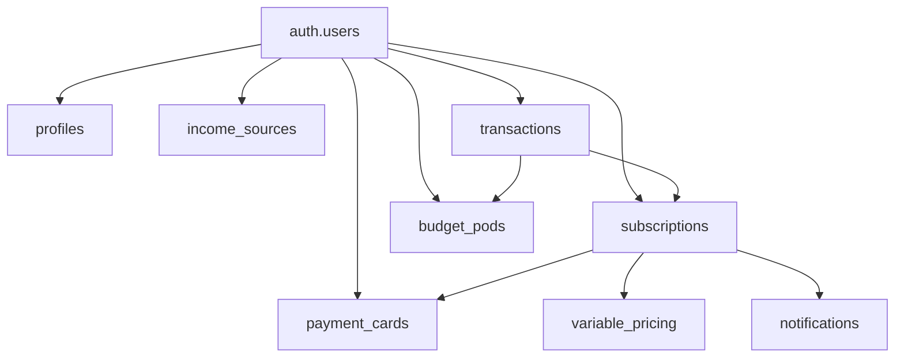

# 🗄️ Supabase Database Setup Guide

**Phase 7**: Data Persistence Implementation  
**Date**: August 19, 2025  

---

## 📋 **Prerequisites**

1. **Supabase Project**: Already created and configured
2. **Environment Variables**: Already set in Vercel
3. **Authentication**: Already working (users can register/login)

---

## 🚀 **Quick Setup**

### **Step 1: Access Supabase SQL Editor**

1. Go to your [Supabase Dashboard](https://app.supabase.com)
2. Select your project
3. Navigate to **SQL Editor** in the left sidebar

### **Step 2: Run the Schema**

1. Click **New Query**
2. Copy the entire contents of `supabase/schema.sql`
3. Paste into the SQL editor
4. Click **Run** (or press Ctrl+Enter)

### **Step 3: Verify Tables Created**

1. Go to **Table Editor** in the left sidebar
2. You should see these tables:
   - `profiles`
   - `payment_cards`
   - `subscriptions`
   - `variable_pricing`
   - `notifications`
   - `budget_categories`
   - `budget_pods`
   - `income_sources`
   - `transactions`
   - `analytics_snapshots`

---

## 🔒 **Security Configuration**

### **Row Level Security (RLS)**

The schema automatically enables RLS for all tables. This ensures:
- Users can only see/modify their own data
- No cross-user data leakage
- Secure multi-tenant architecture

### **Verify RLS is Enabled**

1. Go to **Authentication** → **Policies**
2. Each table should show "RLS enabled"
3. Policies should be active for each table

---

## 🔄 **Real-time Configuration**

### **Enable Real-time Updates**

1. Go to **Database** → **Replication**
2. Under **Source**, find these tables:
   - `subscriptions`
   - `payment_cards`
   - `notifications`
3. Toggle **Enabled** for each table
4. Click **Save**

This enables real-time synchronization across devices.

---

## 🧪 **Testing the Setup**

### **Test 1: Create a Test Subscription**

```sql
-- Run this in SQL Editor (replace with your user ID)
INSERT INTO subscriptions (
  user_id,
  name,
  cost,
  billing_cycle,
  status
) VALUES (
  auth.uid(),  -- Current user
  'Test Subscription',
  9.99,
  'monthly',
  'active'
);
```

### **Test 2: Verify User Isolation**

```sql
-- This should only return YOUR subscriptions
SELECT * FROM subscriptions;
```

### **Test 3: Check Triggers**

```sql
-- Update a subscription and verify updated_at changes
UPDATE subscriptions 
SET name = 'Updated Test'
WHERE name = 'Test Subscription';

SELECT name, updated_at FROM subscriptions;
```

---

## 🔗 **Integration with App**

### **The app now includes:**

1. **Subscription Service** (`src/services/supabase/subscriptionService.ts`)
   - Full CRUD operations for subscriptions
   - Variable pricing support
   - Statistics calculation

2. **Payment Card Service** (`src/services/supabase/paymentCardService.ts`)
   - Card management
   - Default card handling
   - Usage statistics

3. **Sync Hook** (`src/hooks/useSupabaseSync.ts`)
   - Automatic data synchronization
   - Real-time updates
   - Offline capability with local storage fallback

### **How It Works:**

1. **On Login**: Data automatically loads from Supabase
2. **On Create/Update/Delete**: Changes sync to Supabase
3. **Real-time**: Changes on other devices appear instantly
4. **Offline Mode**: Falls back to local storage if offline

---

## 📊 **Database Schema Overview**

### **Core Tables**

| Table | Purpose | Key Features |
|-------|---------|-------------|
| `profiles` | User profiles | Links to auth.users, stores settings |
| `subscriptions` | Service subscriptions | Billing cycles, costs, statuses |
| `payment_cards` | Payment methods | Last 4 digits, nicknames, defaults |
| `variable_pricing` | Price changes | Tracks subscription price variations |
| `notifications` | User alerts | Payment reminders, price changes |
| `budget_pods` | Budget allocations | Fixed amounts or percentages |
| `income_sources` | Income tracking | Multiple income streams |
| `transactions` | Financial history | All money movements |
| `analytics_snapshots` | Performance metrics | Daily/monthly summaries |

### **Relationships**



---

## 🚨 **Troubleshooting**

### **Issue: Tables not creating**
- Check for SQL syntax errors in the console
- Ensure UUID extension is enabled
- Verify you have create table permissions

### **Issue: RLS blocking access**
- Verify user is authenticated
- Check RLS policies are correctly configured
- Test with `auth.uid()` in SQL editor

### **Issue: Real-time not working**
- Enable replication for tables
- Check WebSocket connection in browser console
- Verify Supabase Realtime is enabled in project settings

### **Issue: Data not persisting**
- Check browser console for errors
- Verify environment variables are set in production
- Test Supabase connection with:
  ```javascript
  const { data, error } = await supabase.auth.getUser();
  console.log('User:', data, 'Error:', error);
  ```

---

## ✅ **Verification Checklist**

- [ ] All tables created successfully
- [ ] RLS enabled on all tables
- [ ] Policies active for user data isolation
- [ ] Triggers working (updated_at auto-updates)
- [ ] Real-time enabled for key tables
- [ ] Test subscription created and visible
- [ ] App successfully reads/writes data
- [ ] Multiple device sync working

---

## 🎉 **Success Indicators**

When everything is working:
1. Users can create subscriptions that persist across sessions
2. Data syncs across multiple devices/browsers
3. Payment cards can be managed and set as default
4. Real-time updates appear without refresh
5. Offline changes sync when back online

---

## 📚 **Next Steps**

With data persistence complete, you can now:
1. Add notification system for payment reminders
2. Implement subscription analytics dashboard
3. Add data export functionality
4. Create budget alerts and warnings
5. Build subscription sharing features

---

*Database schema v1.0.0 - Production Ready*